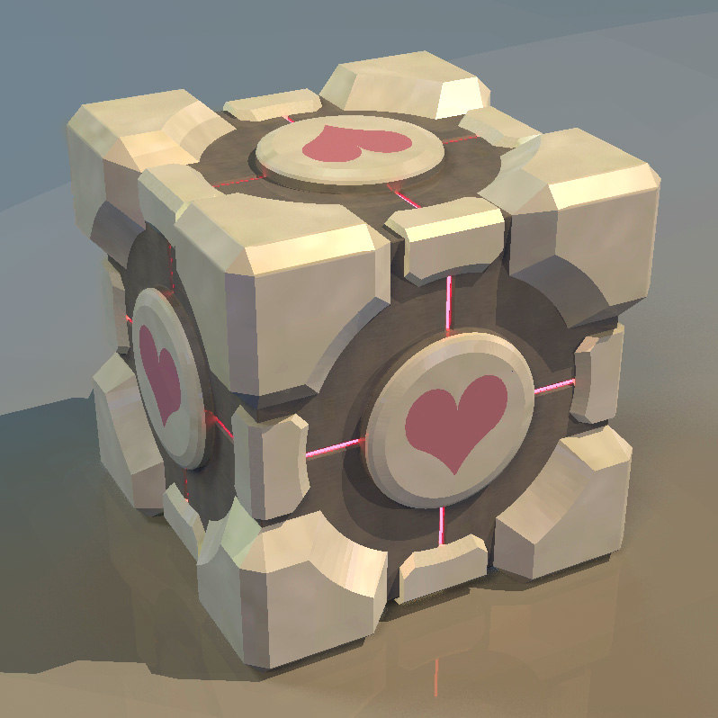
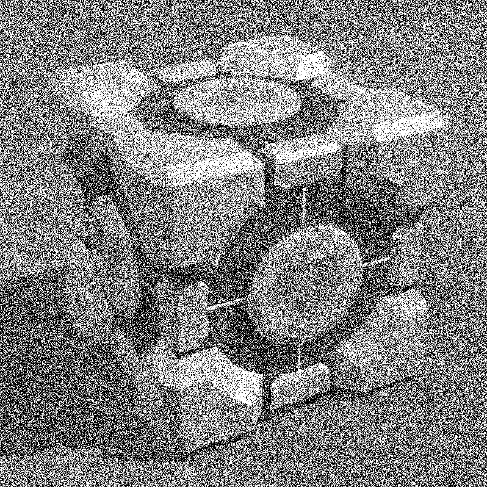
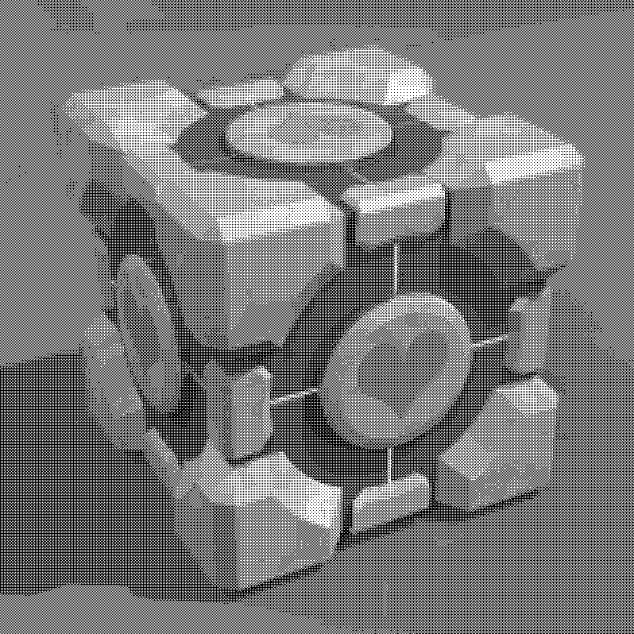
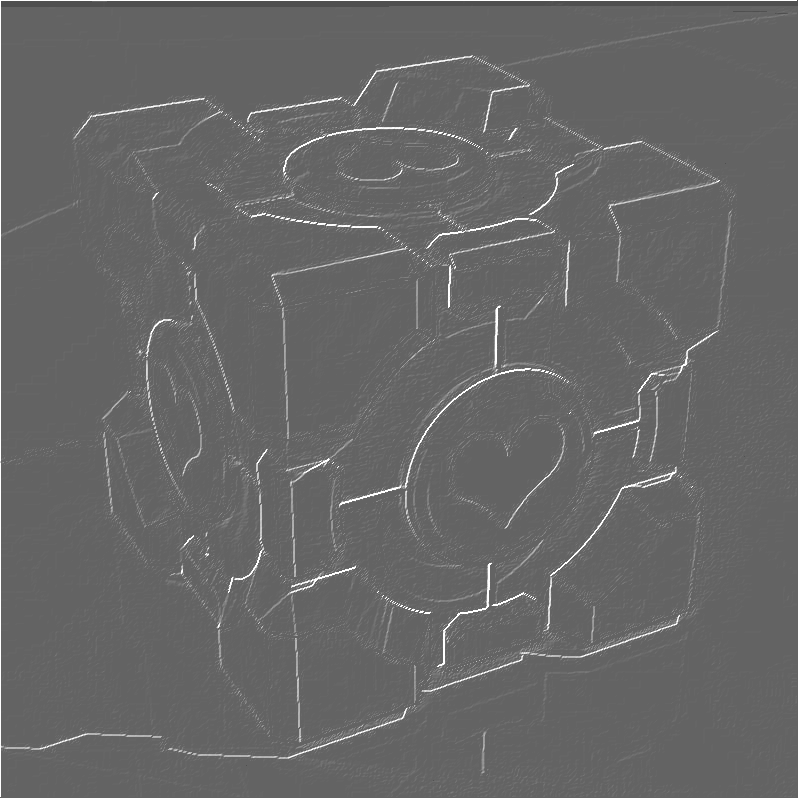
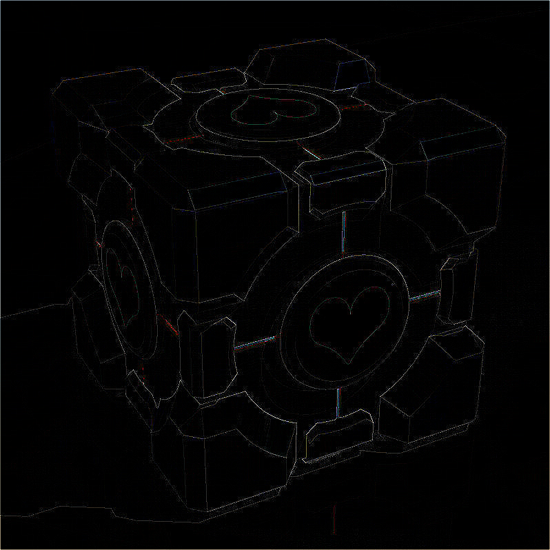
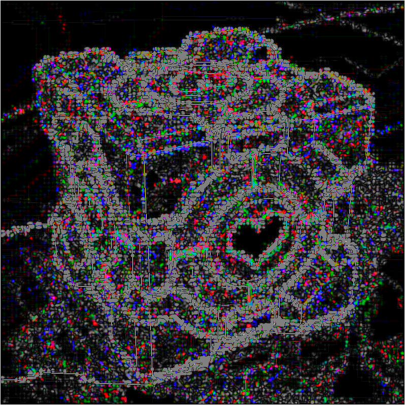

# ImageFXexpirements
C++ program that applies certain filters to an image, made for fun.
## Compilation
Before compilation make sure that you have openmp and sfml installed. If you don't need or dont want async functions you can delete #pragma's for omp or the whole Async method and change all async functions to sync, and also `-fopenmp` from makefile.
```
$> make
```
## Examples
In the main function there just a bunch of filters that are available are applied to an image, some of the filters can be applied asyncly to each pixel so there is two function for applying shaders, and a bunch of shader functions such as: 
- Pseudo toner
- Normalized pseudo toner
- Gray scale
- Black and white
- Noizy black and white 
- Color noize
- Nearest neighbour scaling
- Bilinear scaling
- Bicubic scaling
- PostFX for embossing(first in matrix shader section)
- Shrinking
- Expansion
- Matrix filters(you can make your own using ApplyMatrixFilter template)
  - Blur
  - Sharpness
  - Edges
  - Embossing 
  - Custom filter - some random matrix that looks cool in my opinion  
As metioned earlier using ApllyMatrixFunction<> template function, you can make your own shader function for applying standard 9by9 matricies to images, its just 9 integer numbers of matrix listed starting from top left, from right to left, top to bottom, last argument is bool that if set to true, will after applying matrix, will divide all numbers in matrix by their sum. Here is how all matrix shaders from above list were made using it. 
```c++
effectDelegate Blur = ApplyMatrixFilter<1, 2, 1, 2, 4, 2, 1, 2, 1, true>;
effectDelegate Sharpness = ApplyMatrixFilter<-1, -2, -1, -2, 22, -2, -1, -2, -1, true>;
effectDelegate Edges = ApplyMatrixFilter<0, -1, 0, -1, 4, -1, 0, -1, 0, false>;
effectDelegate Embossing = ApplyMatrixFilter<0, -3, 0, -3, 0, 3, 0, 3, 0, false>;
effectDelegate CUSTOMMEGAFILTER = ApplyMatrixFilter<-1, 1, -1, 1, 0, 1, -1, 1, -1, true>;

```
Here some output examples after running the program, you can compile it yourself and run, all file names are pretty much explanatory, as they named by the names of filters they applied and xN for number of times a filter applied. Numbers and letters in the beginning dont mean anything, just to wanted my images to show up in a particular order and groupped in my file explorer(lol).
##### Original file

##### GrayScale+Noise filters

##### Grayscale normalized pseudo toner filters

##### Embossing

##### Edges

##### Some custom matrix filter


